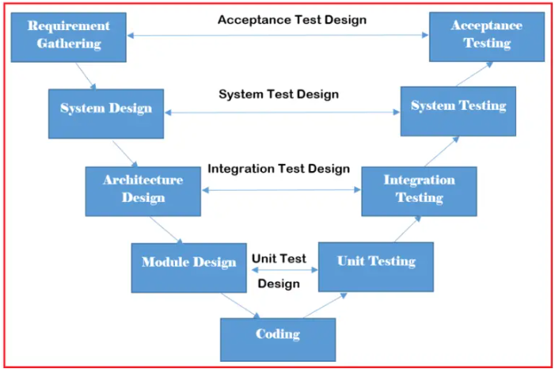

# Secure Software Development
## Content
1. Software Development Life Cycle.
2. Software Development Life Cycle Models
3. Secure Software Development with Java.


## 1. Software Development Life Cycle.
**SDLC** (*Software Development Life Cycle*) is the whole process of any new software development in an organization from the first moment when it is a simple idea until it is already implemented in production.

Nowadays, there are many software development models and it is a challenge for the test engineer to adapt to each of them in order to cover all tasks and activities in an optimal way.

Software development is a historically mature engineering process, which has as its basic methodology the software development life cycle (SDLC). This cycle, which has different application models, always consists of five traditional stages: **Requirements Analysis**, **Design**, **Development**, **Testing** and **Maintenance**.


## 2. Software Development Life Cycle Models
To this day, we have more than 50 recognized SDLC models in use. But None of them is perfect, and each brings its favorable aspects and disadvantages for a specific software development project or a team.

Here, we have listed the top five most popular SDLC models:

### 2.1. Waterfall Model
It is the fundamental model of the software development life cycle. This is a very simple model. The waterfall model is not in practice anymore, but it is the basis for all other SDLC models. Because of its simple structure, the waterfall model is easier to use and provides a tangible output. In the waterfall model, once a phase seems to be completed, it cannot be changed, and due to this less flexible nature, the waterfall model is not in practice anymore. 


### 2. Agile Model
The agile model in SDLC was mainly designed to adapt to changing requests quickly. The main goal of the Agile model is to facilitate quick project completion. The agile model refers to a group of development processes. These processes have some similar characteristics but also possess certain subtle differences among themselves.


### 3. Iterative Model
In the Iterative model in SDLC, each cycle results in a semi-developed but deployable version; with each cycle, some requirements are added to the software, and the final cycle results in the software with the complete requirement specification.
 

### 4. Spiral Model
The spiral model in SDLC is one of the most crucial SDLC models that provides support for risk handling. It has various spirals in its diagrammatic representation; the number of spirals depends upon the type of project. Each loop in the spiral structure indicates the Phases of the Spiral model.  

### 5. V-Shaped Model
The V-shaped model in SDLC is executed in a sequential manner in V-shape. Each stage or phase of this model is integrated with a testing phase. After every development phase, a testing phase is associated with it, and the next phase will start once the previous phase is completed, i.e., development & testing. It is also known as the verification or validation model.
 

### 6. Big Bang Model
The Big Bang model in SDLC is a term used to describe an informal and unstructured approach to software development, where there is no specific planning, documentation, or well-defined phases.
he Big bang model is an SDLC model that starts from nothing. It is the simplest model in SDLC (Software Development Life Cycle) as it requires almost no planning. However, it requires lots of funds and coding and takes more time. The name big bang model was set after the “Great Big Bang” which led to the development of galaxies, stars, planets, etc. Similarly, this SDLC model combines time, efforts, and resources to build a product. The product is gradually built as the requirements from the customer come, however, the end product might not meet the actual requirements.


## 3. Secure Software Development with Java.

### 3.1. SQL Injection in Java
**SQL injection** is a common security vulnerability where an attacker can manipulate SQL queries by inserting malicious input. Here's an example of how this might occur in a Java application:

#### Insecure Example:

```java
import java.sql.Connection;
import java.sql.DriverManager;
import java.sql.ResultSet;
import java.sql.Statement;
import java.util.Scanner;

public class SQLInjectionExample {
    public static void main(String[] args) {
        try {
            Scanner scanner = new Scanner(System.in);
            System.out.println("Enter your username:");
            String username = scanner.nextLine();

            Connection connection = DriverManager.getConnection("jdbc:mysql://localhost:3306/mydb", "user", "password");
            Statement statement = connection.createStatement();
            
            // Vulnerable SQL query
            String query = "SELECT * FROM users WHERE username = '" + username + "';";
            ResultSet resultSet = statement.executeQuery(query);

            if (resultSet.next()) {
                System.out.println("Welcome, " + resultSet.getString("username"));
            } else {
                System.out.println("User not found.");
            }

            connection.close();
        } catch (Exception e) {
            e.printStackTrace();
        }
    }
}
```

#### Vulnerability Explanation:
- If the user inputs something like: `' OR '1'='1`, the query becomes:
  ```sql
  SELECT * FROM users WHERE username = '' OR '1'='1';
  ```
  This will likely return all rows in the `users` table, allowing unauthorized access.

#### Secure Solution Using Prepared Statements:
To mitigate SQL injection, you should use **prepared statements** with parameterized queries:

```java
import java.sql.Connection;
import java.sql.DriverManager;
import java.sql.PreparedStatement;
import java.sql.ResultSet;
import java.util.Scanner;

public class SecureSQLExample {
    public static void main(String[] args) {
        try {
            Scanner scanner = new Scanner(System.in);
            System.out.println("Enter your username:");
            String username = scanner.nextLine();

            Connection connection = DriverManager.getConnection("jdbc:mysql://localhost:3306/mydb", "user", "password");
            
            // Secure query using PreparedStatement
            String query = "SELECT * FROM users WHERE username = ?";
            PreparedStatement preparedStatement = connection.prepareStatement(query);
            preparedStatement.setString(1, username);

            ResultSet resultSet = preparedStatement.executeQuery();

            if (resultSet.next()) {
                System.out.println("Welcome, " + resultSet.getString("username"));
            } else {
                System.out.println("User not found.");
            }

            connection.close();
        } catch (Exception e) {
            e.printStackTrace();
        }
    }
}
```

#### Key Takeaways:
1. Always use `PreparedStatement` or similar mechanisms to avoid directly concatenating user input into SQL queries.
2. Validate and sanitize user input, even when using prepared statements.
3. Employ tools and libraries that help prevent SQL injection, like ORM frameworks (e.g., Hibernate, JPA).

## References:
- [SDLC:: geeksforgeeks.org](https://www.geeksforgeeks.org/software-development-life-cycle-sdlc/)