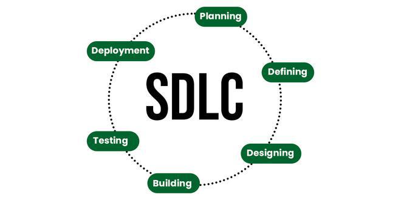

# Secure Software Development
## Content
1. Software Development Life Cycle.
2. Secure Software Development with Java.


## 1. Software Development Life Cycle.
**SDLC** (*Software Development Life Cycle*) is the whole process of any new software development in an organization from the first moment when it is a simple idea until it is already implemented in production.

Nowadays, there are many software development models and it is a challenge for the test engineer to adapt to each of them in order to cover all tasks and activities in an optimal way.

Software development is a historically mature engineering process, which has as its basic methodology the software development life cycle (SDLC). This cycle, which has different application models, always consists of five traditional stages: **Requirements Analysis**, **Design**, **Development**, **Testing** and **Maintenance**.


## 2. Secure Software Development with Java.

### 2.1. SQL Injection in Java
**SQL injection** is a common security vulnerability where an attacker can manipulate SQL queries by inserting malicious input. Here's an example of how this might occur in a Java application:

#### Insecure Example:

```java
import java.sql.Connection;
import java.sql.DriverManager;
import java.sql.ResultSet;
import java.sql.Statement;
import java.util.Scanner;

public class SQLInjectionExample {
    public static void main(String[] args) {
        try {
            Scanner scanner = new Scanner(System.in);
            System.out.println("Enter your username:");
            String username = scanner.nextLine();

            Connection connection = DriverManager.getConnection("jdbc:mysql://localhost:3306/mydb", "user", "password");
            Statement statement = connection.createStatement();
            
            // Vulnerable SQL query
            String query = "SELECT * FROM users WHERE username = '" + username + "';";
            ResultSet resultSet = statement.executeQuery(query);

            if (resultSet.next()) {
                System.out.println("Welcome, " + resultSet.getString("username"));
            } else {
                System.out.println("User not found.");
            }

            connection.close();
        } catch (Exception e) {
            e.printStackTrace();
        }
    }
}
```

#### Vulnerability Explanation:
- If the user inputs something like: `' OR '1'='1`, the query becomes:
  ```sql
  SELECT * FROM users WHERE username = '' OR '1'='1';
  ```
  This will likely return all rows in the `users` table, allowing unauthorized access.

#### Secure Solution Using Prepared Statements:
To mitigate SQL injection, you should use **prepared statements** with parameterized queries:

```java
import java.sql.Connection;
import java.sql.DriverManager;
import java.sql.PreparedStatement;
import java.sql.ResultSet;
import java.util.Scanner;

public class SecureSQLExample {
    public static void main(String[] args) {
        try {
            Scanner scanner = new Scanner(System.in);
            System.out.println("Enter your username:");
            String username = scanner.nextLine();

            Connection connection = DriverManager.getConnection("jdbc:mysql://localhost:3306/mydb", "user", "password");
            
            // Secure query using PreparedStatement
            String query = "SELECT * FROM users WHERE username = ?";
            PreparedStatement preparedStatement = connection.prepareStatement(query);
            preparedStatement.setString(1, username);

            ResultSet resultSet = preparedStatement.executeQuery();

            if (resultSet.next()) {
                System.out.println("Welcome, " + resultSet.getString("username"));
            } else {
                System.out.println("User not found.");
            }

            connection.close();
        } catch (Exception e) {
            e.printStackTrace();
        }
    }
}
```

#### Key Takeaways:
1. Always use `PreparedStatement` or similar mechanisms to avoid directly concatenating user input into SQL queries.
2. Validate and sanitize user input, even when using prepared statements.
3. Employ tools and libraries that help prevent SQL injection, like ORM frameworks (e.g., Hibernate, JPA).

## References:
- [SDLC:: geeksforgeeks.org](https://www.geeksforgeeks.org/software-development-life-cycle-sdlc/)